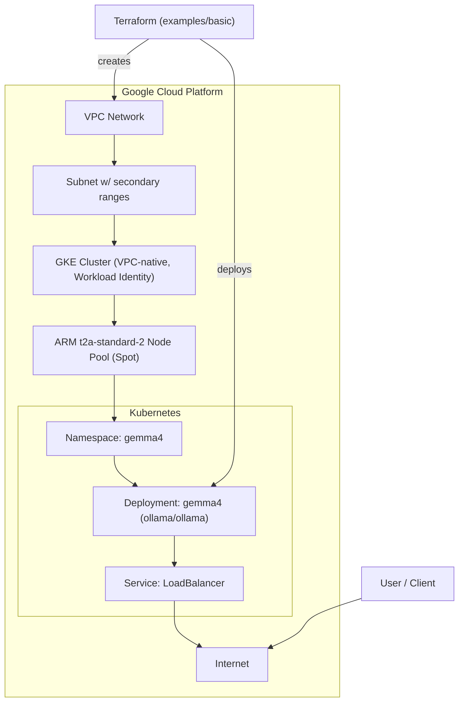

# GKE Terraform Configuration for Gemma 4

Terraform configuration for a cost-optimized GKE cluster running Google's [Gemma 4](https://ollama.com/library/gemma4) model, served by [Ollama](https://ollama.com).

## Features

- Modular layout (`modules/network`, `modules/gke`, `modules/gemma4`) wired together by an example consumer at `examples/basic/`.
- Cost-optimized GKE node pool using ARM-based `t2a-standard-2` Spot VMs.
- Auto-detects `project_id`, `region`, `zone`, and billing/quota project from the local `gcloud` config — apply with zero variables.
- Workload Identity, Gateway API, and Managed Prometheus enabled by default.
- Dedicated node pool with taints + tolerations so only Gemma 4 pods land on it.
- Pulls the chosen Gemma 4 model into Ollama on container startup via a `postStart` lifecycle hook.
- Optional GPU node pool path documented for the larger `26b` / `31b` variants.

## Architecture



## Prerequisites

- [Terraform](https://developer.hashicorp.com/terraform/downloads) **>= 1.13**
- [Google Cloud SDK (`gcloud`)](https://cloud.google.com/sdk/docs/install) authenticated against your project
- [`jq`](https://jqlang.org/download/) on `PATH` (used to marshal `gcloud` values into Terraform)
- A GCP project with billing enabled and the following APIs:
  - `compute.googleapis.com`
  - `container.googleapis.com`

## Zero-config quick start

```bash
# 1. Authenticate
gcloud auth login
gcloud auth application-default login
gcloud config set project YOUR_PROJECT_ID
gcloud config set compute/region us-central1
gcloud config set compute/zone   us-central1-a

# 2. Apply
cd examples/basic
terraform init
terraform apply
```

That's it. Terraform pulls `project_id`, `region`, and `zone` straight from your `gcloud` config — no `terraform.tfvars` needed.

To override anything, copy and edit:

```bash
cp terraform.tfvars.example terraform.tfvars
$EDITOR terraform.tfvars
```

## Talking to Gemma 4

```bash
# Configure kubectl
$(terraform output -raw kubectl_configure_command)

# Watch the rollout
$(terraform output -raw gemma4_check_status_command)

# Get the LoadBalancer IP
EXTERNAL_IP=$(kubectl -n gemma4 get svc gemma4 -o jsonpath='{.status.loadBalancer.ingress[0].ip}')

# Generate
curl http://$EXTERNAL_IP/api/generate -d '{
  "model":"gemma4:e2b",
  "prompt":"Explain GKE Workload Identity in one paragraph."
}'
```

## Model selection

Available [Gemma 4 tags on Ollama](https://ollama.com/library/gemma4):

| Tag | Size | Context | Modalities | Suggested node |
| --- | --- | --- | --- | --- |
| `gemma4:e2b` (default) | 7.2 GB | 128K | Text, Image | `t2a-standard-2` (tight) / `t2a-standard-4` (recommended) |
| `gemma4:e4b` / `gemma4:latest` | 9.6 GB | 128K | Text, Image | `t2a-standard-4` |
| `gemma4:26b` (MoE) | 18 GB | 256K | Text, Image | GPU (e.g. `g2-standard-12` + `nvidia-l4`) |
| `gemma4:31b` (Dense) | 20 GB | 256K | Text, Image | GPU |
| `gemma4:31b-cloud` | – | 256K | Text, Image | Ollama Cloud only — not deployable here |

> **Note**: `t2a-standard-2` (8 GiB total RAM) is the cheapest viable default and runs `gemma4:e2b`, but allocatable memory is tight. If you see OOMKills or slow cold starts, switch to `t2a-standard-4`.

Switch models by setting `gemma4_model` in `terraform.tfvars`.

## Advanced

### GPU node pool (for `gemma4:26b` / `gemma4:31b`)

```hcl
machine_type      = "g2-standard-12"
accelerator_type  = "nvidia-l4"
accelerator_count = 1

gemma4_model = "gemma4:26b"
gemma4_resources = {
  cpu_request    = "4"
  cpu_limit      = "8"
  memory_request = "24Gi"
  memory_limit   = "32Gi"
}
```

The GKE module enables NVIDIA driver auto-install (`gpu_driver_version = "LATEST"`) and ARM tolerations are still applied — drop the `kubernetes.io/arch=arm64` toleration in `modules/gemma4/variables.tf` if you switch to amd64 GPU nodes.

### Private cluster

```hcl
private_cluster  = true
# master_ipv4_cidr defaults to 172.16.0.0/28
```

### Remote state (optional)

Add a backend block such as:

```hcl
terraform {
  backend "gcs" {
    bucket = "your-tfstate-bucket"
    prefix = "gemma4"
  }
}
```

then `terraform init -reconfigure`.

## Cleaning up

```bash
cd examples/basic
terraform destroy
```

`deletion_protection` defaults to `false`, so destroy works without extra steps.

## Repository layout

```
.
├── README.md
├── GEMINI.md
├── examples/basic/      # zero-config consumer of all three modules
└── modules/
    ├── network/         # VPC + subnet with secondary ranges
    ├── gke/             # cluster + node pool
    └── gemma4/          # namespace, deployment, service (Ollama serving Gemma 4)
```

## Notes

- Spot VMs can be reclaimed at any time; for steadier availability set `use_spot_vms = false`.
- ARM compatibility: `ollama/ollama` is multi-arch (`linux/amd64`, `linux/arm64`) and runs natively on `t2a` nodes.
- `COS_CONTAINERD` is the node image type and is the recommended default for GKE.
